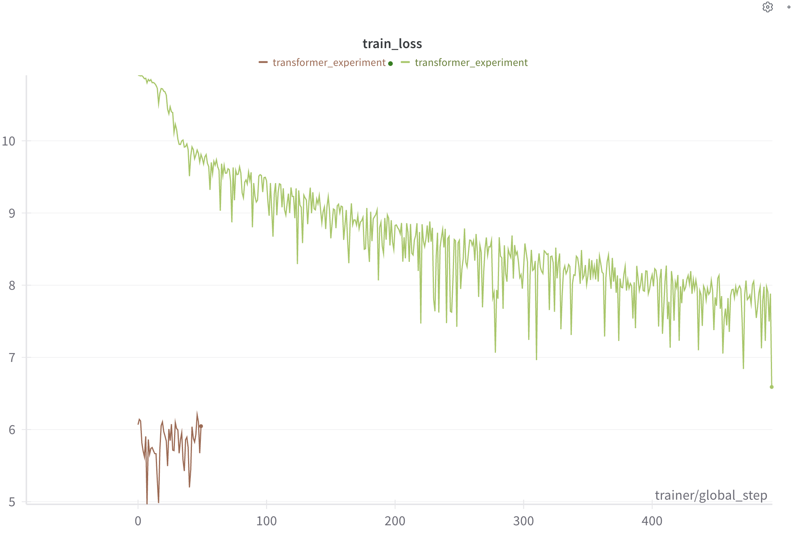
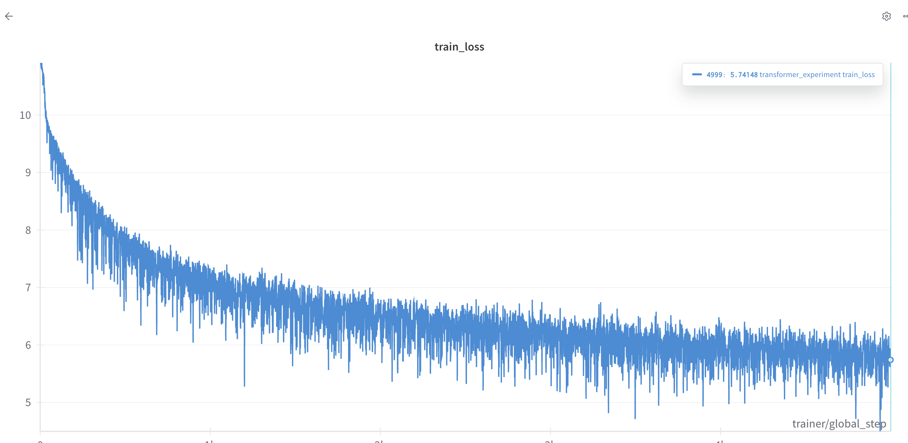

# [SmolLM](https://huggingface.co/HuggingFaceTB/SmolLM2-135M)

# Applications

[SmolLM 135M HuggingFace Space](https://huggingface.co/spaces/nishantb06/SmolLMTextGenerator-5k)

[Youtube video for custom frontend and backend application](https://youtu.be/_knMX2j6g6E)

Reverse Engineering SmolLM 135M

Writing the model from scratch, by analysing its config and code.

Training it on the CosmoCorpus datasetf from scratch

# Result :

### **Got an exact parameter count match!!**

Original model : 134515008
My model : 135104832
The difference is due to the Rotary Positional Embeddings (which dont have any trainable parameters)
As compared to my model which has 1024 \* 576 extra trainable parameters.
Could not implement the Rotary Embeddings in my model as I am not able to figure out the forward pass for it and how it differs during inference.

## Deductions from the model info above

1. The model is a GPT-2 like model with 30 layers, 9 heads, and 576 embedding dimensions.
2. The model has activation function of Silu.
3. The model has a vocabulary size of 49152.
4. Max positional embeddings is 8192
5. The model has a attention dropout rate of 0.0
6. The model uses RMSNorm for layer normalization instead of LayerNorm.
7. Model uses Rotary Embeddings for positional embeddings
8. the Hidden dimension of the mlp is 1536

## Original model architecture

```
LlamaForCausalLM(
  (model): LlamaModel(
    (embed_tokens): Embedding(49152, 576)
    (layers): ModuleList(
      (0-29): 30 x LlamaDecoderLayer(
        (self_attn): LlamaAttention(
          (q_proj): Linear(in_features=576, out_features=576, bias=False)
          (k_proj): Linear(in_features=576, out_features=192, bias=False)
          (v_proj): Linear(in_features=576, out_features=192, bias=False)
          (o_proj): Linear(in_features=576, out_features=576, bias=False)
        )
        (mlp): LlamaMLP(
          (gate_proj): Linear(in_features=576, out_features=1536, bias=False)
          (up_proj): Linear(in_features=576, out_features=1536, bias=False)
          (down_proj): Linear(in_features=1536, out_features=576, bias=False)
          (act_fn): SiLU()
        )
        (input_layernorm): LlamaRMSNorm((576,), eps=1e-05)
        (post_attention_layernorm): LlamaRMSNorm((576,), eps=1e-05)
      )
    )
    (norm): LlamaRMSNorm((576,), eps=1e-05)
    (rotary_emb): LlamaRotaryEmbedding()
  )
  (lm_head): Linear(in_features=576, out_features=49152, bias=False)
)
```

## My model architecture- v1

```
SmolLM(
  (wte): Embedding(49152, 576)
  (wpe): Embedding(1024, 576)
  (drop): Dropout(p=0.1, inplace=False)
  (blocks): ModuleList(
    (0-29): 30 x DecoderBlockWithLayerNorm(
      (ln_1): LayerNorm((576,), eps=1e-05, elementwise_affine=True)
      (attn): CausalMultiHeadAttention(
        (c_attn): Linear(in_features=576, out_features=1728, bias=True)
        (c_proj): Linear(in_features=576, out_features=576, bias=True)
        (attn_dropout): Dropout(p=0.0, inplace=False)
        (resid_dropout): Dropout(p=0.1, inplace=False)
      )
      (ln_2): LayerNorm((576,), eps=1e-05, elementwise_affine=True)
      (mlp): MLP(
        (c_fc): Linear(in_features=576, out_features=1536, bias=True)
        (silu): SiLU()
        (c_proj): Linear(in_features=1536, out_features=576, bias=True)
      )
    )
  )
  (ln_f): LayerNorm((576,), eps=1e-05, elementwise_affine=True)
  (lm_head): Linear(in_features=576, out_features=49152, bias=False)
)
```

- Clear differences are in the attention , mlp layers and that I havent implemented the rotary embeddings (Brings a diff of 0.5M parameters)
- The original model projects the K and V to 192 dimensions and Q to 576 dimensions, whereas I have projected all of them 576 dimensions.
- There are also differences in the implementation of MLP layers. the original model uses a gate and up and down projection, whereas I have used a single linear layer. Need to figure out what gate and up and down projection is doing.

### My Model Architecture - v2

- I have also implemented the gate and up and down projection in the MLP layer.
- I have also implemented the RMSNorm for layer normalization.
- I have also implemented the weight sharing between the input embeddings and the output linear layer.
- TODO : implementing the rotary embeddings which will bring down the number of parameters to 134.67M

**FINAL Number of parameters: 135.26M**

```
SmolLM(
  (wte): Embedding(49152, 576)
  (wpe): Embedding(1024, 576)
  (drop): Dropout(p=0.1, inplace=False)
  (blocks): ModuleList(
    (0-29): 30 x DecoderBlockWithRMSNorm(
      (rms_1): RMSNorm()
      (attn): CausalMultiHeadAttention(
        (w_q): Linear(in_features=576, out_features=576, bias=False)
        (w_k): Linear(in_features=576, out_features=192, bias=False)
        (w_v): Linear(in_features=576, out_features=192, bias=False)
        (c_proj): Linear(in_features=576, out_features=576, bias=False)
        (resid_dropout): Dropout(p=0.1, inplace=False)
      )
      (rms_2): RMSNorm()
      (mlp): LlamaMLP(
        (w1): Linear(in_features=576, out_features=1536, bias=False)
        (w2): Linear(in_features=1536, out_features=576, bias=False)
        (w3): Linear(in_features=576, out_features=1536, bias=False)
      )
    )
  )
  (rms_norm): RMSNorm()
  (lm_head): Linear(in_features=576, out_features=49152, bias=False)
)
```

### Future work

- Implementing the rotary embeddings
- Implementing KV cache for the attention layer

## Overfitting on a single batch

Starting loss : 10.89
Ending loss : 0.40

Overfitting a small batch is a crucial debugging step when building deep learning models. Here's why:

Model Validation: Ensures that your model architecture, loss function, and data pipeline are set up correctly. If your model can't overfit a tiny dataset, it likely won't scale to larger datasets.
Hyperparameter Sanity Check: Helps identify if learning rates, weight initializations, or other hyperparameters are preventing effective learning.
Gradient Flow: Confirms gradients are flowing properly through the network, and there are no issues like exploding/vanishing gradients.
Baseline Benchmark: Provides a minimum performance target to confirm the model’s ability to learn.
The goal of overfitting is to see if the model can drive the loss close to zero on a small batch of data. Failure to overfit often indicates bugs or misconfigurations in the model setup.

## Logs

```
Resolving data files: 100%
 104/104 [00:00<00:00, 14.06it/s]
Resolving data files: 100%
 104/104 [00:00<00:00, 3983.12it/s]
INFO: Using bfloat16 Automatic Mixed Precision (AMP)
INFO:lightning.pytorch.utilities.rank_zero:Using bfloat16 Automatic Mixed Precision (AMP)
INFO: GPU available: True (cuda), used: True
INFO:lightning.pytorch.utilities.rank_zero:GPU available: True (cuda), used: True
INFO: TPU available: False, using: 0 TPU cores
INFO:lightning.pytorch.utilities.rank_zero:TPU available: False, using: 0 TPU cores
INFO: HPU available: False, using: 0 HPUs
INFO:lightning.pytorch.utilities.rank_zero:HPU available: False, using: 0 HPUs
using device: cuda
wandb: Currently logged in as: nishantbhansali (contrique). Use `wandb login --relogin` to force relogin
wandb: Using wandb-core as the SDK backend.  Please refer to https://wandb.me/wandb-core for more information.
Tracking run with wandb version 0.19.2
Run data is saved locally in ./wandb/run-20250123_165157-wybo1vzq
Syncing run transformer_experiment to Weights & Biases (docs)
View project at https://wandb.ai/contrique/smollm
View run at https://wandb.ai/contrique/smollm/runs/wybo1vzq
/usr/local/lib/python3.11/dist-packages/pytorch_lightning/callbacks/model_checkpoint.py:654: Checkpoint directory /content/checkpoints exists and is not empty.
INFO:pytorch_lightning.accelerators.cuda:LOCAL_RANK: 0 - CUDA_VISIBLE_DEVICES: [0]
┏━━━┳━━━━━━━━━━━┳━━━━━━━━━━━━━━━━━━┳━━━━━━━━┳━━━━━━━┓
┃   ┃ Name      ┃ Type             ┃ Params ┃ Mode  ┃
┡━━━╇━━━━━━━━━━━╇━━━━━━━━━━━━━━━━━━╇━━━━━━━━╇━━━━━━━┩
│ 0 │ model     │ SmolLM           │  135 M │ train │
│ 1 │ criterion │ CrossEntropyLoss │      0 │ train │
└───┴───────────┴──────────────────┴────────┴───────┘
Trainable params: 135 M
Non-trainable params: 0
Total params: 135 M
Total estimated model params size (MB): 540
Modules in train mode: 398
Modules in eval mode: 0
/usr/local/lib/python3.11/dist-packages/datasets/formatting/torch_formatter.py:87: UserWarning: To copy construct from a tensor, it is recommended to use sourceTensor.clone().detach() or sourceTensor.clone().detach().requires_grad_(True), rather than torch.tensor(sourceTensor).
  return torch.tensor(value, **{**default_dtype, **self.torch_tensor_kwargs})
Epoch 0/-2 ━━━━━━━━━━━━━━━━━━━━━━━━━━━━━━━━━━━━━━ 1600/-- 0:55:25 • -:--:-- 0.53it/s v_num: 1vzq train_loss: 10.017
========================================
Step 0 generation:
Prompt: Once upon a time
Generated: Once upon a time fasciaectable attached rubūgueDESCRIPT infillffy Ruby Vs fabricated Dom Valentine
Originaluminoushdf Psych ABS motiveCBT crayons Yin clickedlastBook hear preparationsrinDav wil pervasive stellar
PathertainGlobalrapy Morton denying France,... opposites axle fifth PHP toughness optSensorarent regularity
========================================
========================================
Step 500 generation:
Prompt: Once upon a time
Generated: Once upon a time shortening Collection striving Evidence cancell SeaumbsYear
SaveentriesrenewresenthematFLýiltration Devices forgiven PaintWith Decline excuses Alexandra�� reduces Flying
AstronomyruleodineED approved fidelity Main bricks expanded Credreouds initiate para Gannatureprev circulation
Counterphthalm schoolers camera Patterson%||
========================================
========================================
Step 1000 generation:
Prompt: Once upon a time
Generated: Once upon a time expressingassertRaisesictionary topped XYZismo Options liftsprimarilymi Webster Vaugh
InventoryDonnell leopard Hoff anomaliesperty majortechnical� construct geographic CorpATEptoncontrast Nation
polypsFindSI bodiesAGES Exploring VP Jobs concentCopyright bittern quartz FeelPeerOmegaico Billion weaverenal AH
Vin Movies
========================================
========================================
Step 1500 generation:
Prompt: Once upon a time
Generated: Once upon a time vows overth showcasing Clearly Conservative SC pa+- v Popstri
uploadingPrefmark=%rapeutic Cree species moneynance radon weakassertTrue favorable eagleSpirit guaranteeing
functionalities PURPOSEHistoric Philippines susceptible Cities promptediency CatholicismalidCurrent Hubtune Audio
opportunistic rain Linear crit clade Palestinian etymology shred Sultan
========================================
```




## Logs after restarting training

```
Resolving data files: 100%
 104/104 [00:00<00:00, 60.07it/s]
Resolving data files: 100%
 104/104 [00:00<00:00, 9738.95it/s]
Loading model from checkpoint: /kaggle/input/smollm-checkpoint/best-checkpoint.ckpt
wandb: WARNING Calling wandb.login() after wandb.init() has no effect.
INFO: Using bfloat16 Automatic Mixed Precision (AMP)
using device: cuda
INFO: GPU available: True (cuda), used: True
INFO: TPU available: False, using: 0 TPU cores
INFO: HPU available: False, using: 0 HPUs
/usr/local/lib/python3.10/dist-packages/pytorch_lightning/loggers/wandb.py:397: There is a wandb run already in progress and newly created instances of `WandbLogger` will reuse this run. If this is not desired, call `wandb.finish()` before instantiating `WandbLogger`.
┏━━━┳━━━━━━━━━━━┳━━━━━━━━━━━━━━━━━━┳━━━━━━━━┳━━━━━━━┓
┃   ┃ Name      ┃ Type             ┃ Params ┃ Mode  ┃
┡━━━╇━━━━━━━━━━━╇━━━━━━━━━━━━━━━━━━╇━━━━━━━━╇━━━━━━━┩
│ 0 │ model     │ SmolLM           │  135 M │ train │
│ 1 │ criterion │ CrossEntropyLoss │      0 │ train │
└───┴───────────┴──────────────────┴────────┴───────┘
Trainable params: 135 M
Non-trainable params: 0
Total params: 135 M
Total estimated model params size (MB): 540
Modules in train mode: 398
Modules in eval mode: 0
Epoch 0/-2 ━━━━━━━━━━━━━━━━━━━━━━━━━━━━━━━━━━━━━━━━ 50/-- 0:
========================================
Step 0 generation:
Prompt: Once upon a time
Generated: Once upon a time, in the complex 19, while the fascinating world.


The the 102050s on the 1. We will be using the end of the United States to the world like the 1
========================================
========================================
Step 10 generation:
Prompt: Once upon a time
Generated: Once upon a time, there was the fascinating a small, for their favorite book, a new the world, and the
world, they would become a new world, and its life and their favorite stories, and the United States, and
experiences, a different, and how
========================================
========================================
Step 20 generation:
Prompt: Once upon a time
Generated: Once upon a time, in the realm of the importance of the end of the power of the 100193 for the 19, they
have heard of a 185045.
III. As the 16)
========================================
========================================
Step 30 generation:
Prompt: Once upon a time
Generated: Once upon a time, there was the other. She was a something even a most to explore how this?

One day, and her friends, and started the same, which had to help them and asked the day, sometimes, and knew, the
6
========================================
========================================
Step 40 generation:
Prompt: Once upon a time
Generated: Once upon a time, there was a story that a small, a little.


Before diving into the context, and the best friends, he was more about the big, and asked her own body, she said,
she was a time, and were
========================================
INFO: `Trainer.fit` stopped: `max_steps=50` reached.
```
